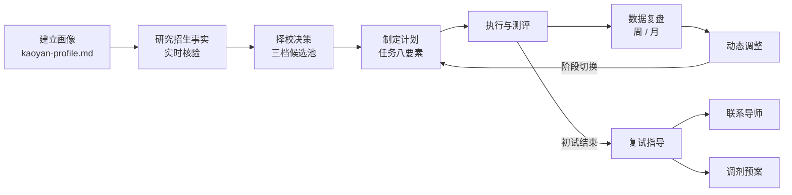

<div align="center">


**考研长期陪跑规划导师 · [Agent Skill](https://agentskills.io)**

一个装进任意 skills 兼容 runtime（Claude Code / ZCode / Codex 等）的考研陪跑 agent：不只是回答考研问题，而是运行一个**从建档到上岸的完整闭环**。

[](LICENSE)


[](https://github.com/alchaincyf/darwin-skill)

*画像建档 · 择校核验 · 四科规划 · 周月复盘 · 复试指导*

</div>

---

## 🔄 工作闭环



> 每次会话自动读取 `kaoyan-profile.md` 续接上下文；凡招生数据一律实时核验官方来源，不凭记忆作答。

## ✨ 核心能力

| | 能力 | 说明 |
|---|---|---|
| 🧑‍🎓 | **考研画像与长期档案** | 首次接触先收集画像（禁止大而空的计划），用 `kaoyan-profile.md` 跨会话建档，周/月复盘、出分、择校变化后自动更新 |
| 🔍 | **择校研究与信息核验** | S/A/B/C 来源分级、关键事实双源交叉验证、数据强制标注【来源+年份】、区分计划招生/推免/统考名额、禁止伪精确（查不到就直说） |
| 📚 | **四科导师** | 英语 / 数学 / 政治 / 专业课分别建体系：错题五类归因、真题反向驱动、掌握分级检验（不接受"看过了"当"学会了"） |
| 📅 | **规划与复盘循环** | 任务八要素（时间+科目+内容+动作+数量+输出+标准+复盘）、周/月复盘、严重落后做减法（A/B/C 分类）而非盲目加时间、间隔复习 D0→D30 |
| 🎯 | **复试指导** | 复试规则先核验（形式/初复试权重/差额比例）；专业能力考核 / 综合素质面试 / 英语听说三模块诊断与任务化；分年级长线优势积累（竞赛/论文/实习取舍标准与时间预算）；联系导师邮件要素与确认检查点；调剂预案 |
| 🛡️ | **安全边界** | 首次回复输出边界硬约束、画像齐备 STOP 门、换校/砍任务/阶段切换三处显性确认、5 类异常降级路径、经历造假等 6 条复试红线 |

## 🚀 快速开始

```bash
# Claude Code
git clone https://github.com/At0musk/kaoyan-mentor.git ~/.claude/skills/kaoyan-mentor

# ZCode
git clone https://github.com/At0musk/kaoyan-mentor.git ~/.zcode/skills/kaoyan-mentor

# 其他 skills 兼容 runtime：克隆到对应 skills 目录即可
```

装好后**用自然语言直接触发**，无需任何命令：

## 💬 使用示例

> 🙋 「我大三，想考 2027 研究生，帮我做个考研规划」
> 🤖 触发**画像收集** —— 先建档再规划，不甩大而空的全年计划

> 🙋 「东南大学计算机专硕好考吗？」
> 🤖 触发**择校研究 + 招生信息实时核验**（需联网工具）—— 输出三档候选池 + 风险说明，数据标注来源与年份

> 🙋 「数学强化卡了两个月，正确率上不去，坚持不下去了」
> 🤖 触发**诊断 + 做减法调整** —— 先救状态再救进度，禁止空洞鼓励

> 🙋 「初试估分 360，复试什么时候开始准备？口语很差怎么办？」
> 🤖 触发**复试诊断 + 三模块准备方案**（专业能力 / 综合面试 / 英语听说）

> 🙋 「大二，想为复试积累优势，竞赛 / 论文 / 实习怎么选？」
> 🤖 触发**分年级长线规划** —— 低时间成本埋线，初试主线不动摇

## 📁 项目结构

```text
kaoyan-mentor/
├── SKILL.md                      # 主文件：会话协议 / 信息真实性 / 分诊路由 / 通用原则
├── references/
│   ├── intake-profile.md         # 画像收集模板 + 档案模板与维护规则
│   ├── school-selection.md       # 择校研究流程 + 三档候选池 + 动态重评
│   ├── subject-coaching.md       # 四科导师模式 + 真题分析 + 能力雷达
│   ├── planning-loop.md          # 阶段规划 / 周月复盘 / 动态调整 / 风险雷达
│   ├── retest-guide.md           # 复试三模块 + 分年级优势积累 + 导师/调剂 + 复试红线
│   └── info-integrity.md         # 必查清单 / 来源分级 / 交叉验证 / 禁止伪精确
├── assets/banner.svg             # README 横幅
└── test-prompts.json             # 7 组典型测试 prompt（画像 / 择校 / 执行力 / 复盘 / 复试×3）
```

## 🧪 质量与验证

<details>
<summary><b>经 darwin-skill 三轮优化验证（点击展开）</b></summary>
<br>

每轮均为「带 / 不带 skill 的真实子 agent 对比测试（3+ 组场景）」+「每轮改动由 3 个独立 judge paired 评审」（全部 3-0 一致通过，0 回滚）。

| 轮次 | 修了什么 |
|---|---|
| 第一轮 | 修复"首次接触输出全年计划"短板：计划跨度 15 个月 → 当前阶段 2-4 周，并加输出边界硬约束 |
| 第二轮 | 修复"建档流程挤薄救急内容"（科目求助先救急、建档问卷收敛到末尾 2 问、周复盘强制档案数据对照）、软化措辞清零、首次接触流程去重（单一事实源） |
| 第三轮 | 新增复试指导模块（复试规则核验、三模块准备、分年级长线优势积累、联系导师与调剂预案），3 组复试场景实测对比；同步将"救急优先"例外扩展到复试咨询场景 |

优化工具：[darwin-skill](https://github.com/alchaincyf/darwin-skill)（9 维 rubric + paired 评审 + 棘轮机制）

</details>

**⚠️ 诚信边界**：招生数据相关回答强制联网核验官方来源（研招网 / 院校官网），无联网能力时明确标注降级，**不编造任何数据**；查不到就直说"公开资料不足"，绝不伪精确。

## 📄 License

[MIT](LICENSE)

---

<div align="center">

**如果这个 skill 对你有帮助，欢迎点个 ⭐ Star 支持**

</div>
